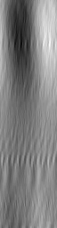

# Wavetable to Image Converter


## Description
*[Serum](https://xferrecords.com/products/serum/) can turn images into wavetables, but how would wavetables look as images?* ~ someone probably

This is a command-line tool that converts WAV files into images. It's useful for generating wavetable images for synths like [Serum](https://xferrecords.com/products/serum/). It generates them based on samples, not spectrum data. 

*Maybe i'll expand this cli in the future* so you could import images to synths like [Harmor](https://www.image-line.com/fl-studio-news/introducing-harmor/) too...

### Examples





## Builting from source

Make sure you have cargo and make installed. Clone this repository and run:

```sh
make build
```

To uninstall, remove `wavetable-to-image` from ~/.local/bin
```sh
rm ~/.local/bin/wavetable-to-image
```


## Usage

```sh
wavetable-to-image --input <input_wav_file> --output <output_image_file> -n <skip>
```

- `--input <input_wav_file>`: Path to the input WAV file.
- `--output <output_image_file>`: Path to save the output image file.
- `-n <skip>`: Number of sample skips per iteration. Adjust this to control the length of the output image.

## Example

```sh
wavetable-to-image --input test.wav --output test.png -n 32
```

This command converts `test.wav` into `test.png`, skipping 32 samples per iteration.


### Batch Conversion
*(temporary workaround)*
```sh
find <input_directory> -type f -name '*.wav' | while read f
do
  wavetable-to-image $f "<output_directory>/$(basename "${f%.wav}.png")" 16
done
```

## Roadmap

- use wgpu library
- image to audio conversion

## License

This project is licensed under the GPL 3.0 License. See the [LICENSE](LICENSE) file for details.
